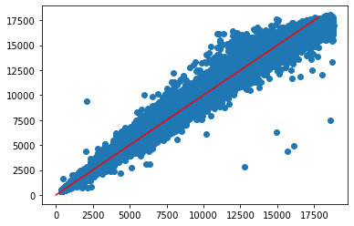

# Kaggle competition - Predicting diamonds prices

There is an existing dataset of diamond prices in relation with the features of each one, such as its weight, dimensions, quality of the cut, color, clarity, etc. The objective was to train a supervised machine learning model that predicts the price of diamonds based on these features. 

To conduct this project, a [Kaggle competition](https://www.kaggle.com/c/diamonds-datamad1020/) was created by the IronHack instructors. In that link we have the train dataset and the features of a subset of diamonds whose price we need to predict. Using the latter, our predictions are evaluated using the Root Mean Square Error. As requirements, we were told to aim to a price prediction with a RMSE below 1000$.

)/News/Files/Gallery/Alrosa%20Diamond%20Sorting%20Center%20Mirny%20credit%20Alrosa%20520.jpg)

## Analyzing and preparing the dataset

The first thing that I did is print a [pair plot of all features](images/before_log.png) using Seaborn. This image shows that the price have an exponential relation with some quiantities. By [putting the price in a base 10 logarithm](images/after_log.png), we see that there is a clear linear trend that is produced. In addition, the values in logarithm of the price are more easily handled and may help the training of the ML models.

Looking at the correlation matrix, depth and table do not seem to be correlated with the price, so we may exclude them. The column `carat`, and the 3 dimensions are highly correlated, so we may use only one of them.

With respect to the categorical variables (`cut`, `color` and `clarity`), we may convert them to dummies. As they show a graduation with quality, we may convert them to numerical variables. I also tried to divide them in dummies with only 2 categories for each column, based on best and worst quality, but this did not provide better results.

In order to choose the best way, I did try different ways of treating the variables. I have chose 8 of them, that can be checked in the [cleaning file](cleaning/clean_func.py).

## Choosing the best ML algorithm

In order to choose the algorithm that has better results predicting the diamonds price I divided the dataset into train and test samples, using a 0.8-0.2 ratio split. Using `sklearn` I imported the following regression models to check which of them provides better results: 
- Simple linear model
- Elastic Net (Ridge and Lasso regularization)
- KNN 
- Random Forest

I also used the `GridSearchCV` library to search within a grid of parameters the best ones, using a division on the train sample of 5 to conduct cross validation. Among the posiible models, I have chosen for each way of treating the features, the method that minimizes the RMSE of the test sample.

For all the possible samples, **the one that gives better results is the Random Forest regression model, with an RMSE rougly in the 550-600$ range normally**, while the other methods provide clearly worst results (RMSE~700-2000$).

Here, my best results were of **RMSE=552.22$**, for a Random Forest (`min_samples_leaf=5, min_samples_split=5`) using the second way of treating the columns (`carat`, the categorical `cut`, `color` and `clarity` with a number range and multiplications between categoricals).

## Trying to improve the results

Representing the true versus the predicted price of the diamonds, I saw a break in the relation for the highest priced ones. I hence tried to divide the fits in two models based on this break using a cut in `x=6.75`, as `x` is highly correlated with the price, but this approach did not help.

Finally, finishing the deadline of the competition I conducted some fine tuning on the parameters for 2 of the best samples using only the Random Forest method. The objective is to search in a wider grid with higher computation time for a better model, but it seems that with the parameters that I've choosen there is no significant imporvement. I've uploaded the best one of these that is calculated with all colums plus the ranged categorical and multiplications between the categorical, as I obtained a Random Forest (`max_depth=100, min_samples_split=5, n_estimators=1500,n_jobs=-1`) with RMSE (test) = 537.12$, that in the Kaggle website was scored with **RMSE=545.52$**.
